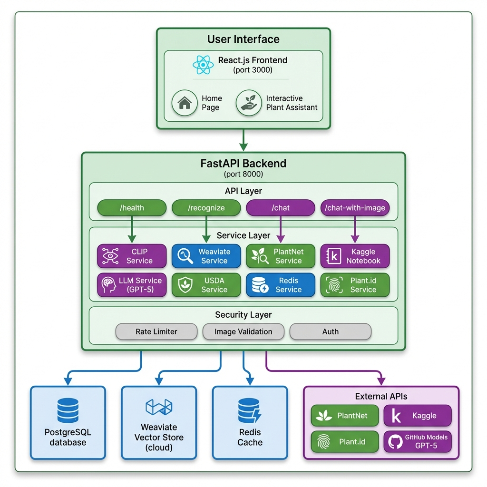

# 🌱 Plant Recognition System
## LLM-Supported Intelligent Plant Recognition and Information System

An AI-powered web application that identifies plants from images and provides detailed botanical information through natural language interactions using a hybrid RAG (Retrieval-Augmented Generation) architecture.

---

## 🎯 Proje Özeti / Project Summary

Bu projenin amacı, kullanıcıların yüklediği bitki görsellerini yapay zekâ desteğiyle tanıyarak ilgili bilgileri otomatik olarak sunan bir sistem geliştirmektir. Sistem, görsel veriyi analiz ederek benzer bitkileri veri tabanındaki kayıtlarla eşleştirir ve Large Language Model (LLM) desteğiyle kullanıcıya doğal dilde açıklamalar üretir.

This system combines computer vision, vector databases, and large language models to create an intelligent botanical assistant. Users can upload plant images or chat with an AI assistant to learn about various plant species.

---

## ✨ Özellikler / Key Features

### 🔬 Görüntü Tanıma / Image Recognition
- **Weighted Ensemble System** - 60% Kaggle + 40% PlantNet ağırlıklı birleştirme
- **Kaggle PlantCLEF API** - CLIP Zero-Shot Classification ile 1.5TB+ dataset
- **PlantNet API** - İkincil tanıma kaynağı (40% ağırlık)
- **Plant.id API** - Tanımladıktan sonra bilgi zenginleştirme (scientific name ile)
- **CLIP Embeddings** - OpenAI CLIP (ViT-B/32) modeliyle 512-boyutlu görsel benzerlik arama
- **Test-Time Augmentation (TTA)** - Çoklu kırpma stratejisi (center + 4 corners)
- **Advanced Image Preprocessing (PIL-based)**:
  - Noise Reduction - `ImageFilter.MedianFilter` ile gürültü azaltma
  - Sharpness Enhancement - `ImageEnhance.Sharpness` (1.3x)
  - Auto Contrast - `ImageEnhance.Contrast` (1.2x)
  - Color Enhancement - `ImageEnhance.Color` (1.1x)
- **USDA Verification** - Tanımlanan bitkiler USDA veritabanında doğrulanıyor

### 🗄️ Veritabanı Sistemi / Database System
- **USDA Plants Database** - 93,158 bitki verisi (Weaviate Cloud'da vektörize)
- **PostgreSQL** - Bitki metadata ve kullanıcı sorgu geçmişi (SQLAlchemy ORM)
- **Weaviate Vector Store** - 512-boyutlu CLIP vektörleri ile cosine similarity arama
- **Image Hash Detection** - SHA256 ile duplicate görüntü tespiti

### 💬 Chatbot Arayüzü / Chatbot Interface
- **Hybrid RAG Pipeline** - Kaggle + PlantNet + USDA + LLM
- **Çoklu LLM Desteği** (Fallback sıralaması):
  1. **GPT-5 via GitHub Models** - Tercih edilen (GITHUB_TOKEN ile)
  2. Google Gemini (gemini-2.0-flash-exp) - Alternatif
  3. OpenRouter / XAI Grok - Opsiyonel
  4. Template-based - LLM olmadan çalışabilme
- **Görüntülü Sohbet** - Bitki görseli + soru ile kombine analiz
- **Konuşma Geçmişi** - Session-based konuşma takibi
- **Türkçe Dil Desteği** - Yanıtlar Türkçe olarak üretilir

### 🔒 Güvenlik ve Performans / Security & Performance
- **6 Katmanlı Güvenlik**:
  1. API Key Authentication (isteğe bağlı)
  2. Rate Limiting (Redis/in-memory fallback)
     - Standard: 10 req/min
     - Strict: 5 req/min (pahalı işlemler için)
  3. Image Size Check (max 10MB)
  4. MIME Type Verification
  5. Magic Bytes Validation (JPEG/PNG/WebP header kontrolü)
  6. PIL Exploit Detection + Content Sanitization (konfigüre edilebilir)
- **Client ID Detection** - X-Forwarded-For header + User ID desteği
- **Image Hash** - SHA256 ile duplicate tespiti
- **Text Sanitization** - SQL injection ve XSS önleme
- **GZip Compression** - Büyük yanıtlar için sıkıştırma (>1000 bytes)
- **CORS Configuration** - Çoklu origin desteği

### 🚀 Caching Sistemi / Caching System
- **Redis (Birincil)**:
  - JSON cache operations (`get_json` / `set_json`)
  - Rate limiting counter (`increment`)
  - TTL desteği (varsayılan: 1 saat)
- **In-Memory Fallback** - Redis yoksa otomatik in-memory cache

### 🖼️ Desteklenen Görüntü Formatları
- JPEG / JPG
- PNG
- WebP
- GIF

### 🚨 Custom Exception Handling
7 özel exception sınıfı ile yapılandırılmış hata yönetimi:
- `WeaviateConnectionError` - Vector DB bağlantı hatası
- `CLIPModelError` - Model yükleme/inference hatası
- `PlantNetAPIError` - PlantNet API hatası
- `ImageValidationError` - Görüntü doğrulama hatası
- `DatabaseError` - PostgreSQL hatası
- `LLMServiceError` - LLM API hatası
- `RateLimitError` - İstek limiti aşıldı

---

## 🛠️ Kullanılan Teknolojiler / Technology Stack

### Backend
| Kategori | Teknoloji |
|----------|-----------|
| **Framework** | FastAPI + Uvicorn (ASGI) |
| **Database** | PostgreSQL + SQLAlchemy ORM |
| **Vector DB** | Weaviate Cloud (v3 API, gRPC desteği) |
| **AI/ML** | CLIP (openai/clip-vit-base-patch32), PyTorch, Transformers |
| **Görüntü İşleme** | Pillow (PIL), ImageEnhance, ImageFilter |
| **Caching** | Redis (async) + In-memory fallback |
| **Validation** | Pydantic v2 |
| **Security** | Custom rate limiting, Image validation |

### Frontend
| Kategori | Teknoloji |
|----------|-----------|
| **Framework** | React.js 18 |
| **UI Library** | Material-UI (MUI) v5 |
| **Routing** | React Router DOM v6 |
| **HTTP Client** | Axios (interceptors ile hata yönetimi) |
| **File Upload** | react-dropzone (drag & drop) |
| **State Management** | Custom hooks (usePlantChat) |
| **Design** | Animated backgrounds, Glassmorphism effects |

### Frontend Bileşenleri / Components
| Component | Açıklama |
|-----------|----------|
| `ImageUpload` | Drag & drop görüntü yükleme |
| `PlantChatSection` | Mesajlaşma arayüzü |
| `PlantContextCard` | Tanımlanan bitki bilgi kartı |
| `PlantMessageItem` | Tek mesaj görüntüleme |
| `PlantImageUploadSection` | Görüntü yükleme alanı |
| `Navigation` | App bar ve routing |

### Frontend Sayfaları / Pages
| Page | Açıklama |
|------|----------|
| `HomePage` | Ana sayfa, landing page |
| `InteractivePlantPage` | Birleşik bitki asistanı |
| `RecognitionPage` | Bitki tanıma sayfası (→ /assistant) |
| `ChatbotPage` | Chatbot sayfası (→ /assistant) |

### Infrastructure
| Kategori | Teknoloji |
|----------|-----------|
| **Containerization** | Docker & Docker Compose |
| **Monitoring** | Grafana (port 3001) |
| **Web Server** | Uvicorn (ASGI, hot reload) |
| **Caching** | Redis (async, optional) |
| **Log Format** | Structured logging with emojis |

### Veri Kaynakları / Data Sources
| Kaynak | Açıklama |
|--------|----------|
| **PlantCLEF 2025** | Kaggle dataset (1.5TB) - CLIP Zero-Shot Classification |
| **PlantNet API** | İkincil tanıma (40% ağırlık), common names, family bilgisi |
| **Plant.id API** | Bilgi zenginleştirme (description, taxonomy, watering) |
| **USDA Plants Database** | 93,158 bitki türü (symbol, scientific name, common name, family) |
| **GBIF** | Global Biodiversity Information Facility ID entegrasyonu |

### 🔄 Weighted Ensemble RAG Pipeline

```
┌─────────────────────────────────────────────────────────────────────────┐
│                        USER UPLOADS IMAGE                               │
└────────────────────────────────┬────────────────────────────────────────┘
                                 ▼
┌─────────────────────────────────────────────────────────────────────────┐
│ STEP 1: PARALLEL IDENTIFICATION                                         │
│                                                                          │
│  ┌──────────────────────┐      ┌──────────────────────┐                 │
│  │   Kaggle PlantCLEF   │      │     PlantNet API     │                 │
│  │   (CLIP Zero-Shot)   │      │   (Secondary Source) │                 │
│  │      60% Weight      │      │      40% Weight      │                 │
│  └──────────┬───────────┘      └──────────┬───────────┘                 │
│             │                              │                             │
│             └──────────┬───────────────────┘                             │
│                        ▼                                                 │
│ STEP 2: WEIGHTED ENSEMBLE                                                │
│  weighted_score = (kaggle × 0.6) + (plantnet × 0.4)                     │
│                        │                                                 │
│                        ▼                                                 │
│ STEP 3: USDA VERIFICATION                                                │
│  - Validate scientific names                                             │
│  - Enrich with family, common name                                       │
│                        │                                                 │
│                        ▼                                                 │
│ STEP 3.5: PLANT.ID ENRICHMENT                                            │
│  - GET /kb/plants/{scientific_name}                                      │
│  - Add description, taxonomy, watering info                              │
│                        │                                                 │
│                        ▼                                                 │
│ STEP 4: GPT-5 RAG RESPONSE                                               │
│  - Context: All sources + weighted scores                                │
│  - Turkish natural language explanation                                  │
└─────────────────────────────────────────────────────────────────────────┘
```

---

## 🏗️ System Architecture



<details>
<summary>📄 ASCII Diagram (Click to expand)</summary>

```
┌─────────────────────────────────────────────────────────────────┐
│                         USER INTERFACE                           │
│                                                                   │
│  ┌──────────────┐  ┌──────────────────────┐                     │
│  │  Home Page   │  │ Interactive Plant    │                     │
│  │              │  │    Assistant Page    │                     │
│  └──────────────┘  └──────────────────────┘                     │
│                                                                   │
│         React.js + Material-UI Frontend (Port 3000)              │
│         ✨ Animated Backgrounds + Glassmorphism UI               │
└───────────────────────────┬───────────────────────────────────────┘
                            │ HTTP/REST API
                            ▼
┌─────────────────────────────────────────────────────────────────┐
│                      FASTAPI BACKEND (Port 8000)                 │
│                                                                   │
│  ┌───────────────────────────────────────────────────────────┐  │
│  │                       API LAYER                            │  │
│  │   /health  │  /recognize  │  /chat  │  /chat-with-image   │  │
│  └───────────────────────────────────────────────────────────┘  │
│                            │                                      │
│  ┌───────────────────────────────────────────────────────────┐  │
│  │                    SERVICE LAYER                           │  │
│  │  ┌──────────┐ ┌──────────┐ ┌──────────┐ ┌─────────────┐  │  │
│  │  │  CLIP    │ │ Weaviate │ │ PlantNet │ │   Kaggle    │  │  │
│  │  │ Service  │ │ Service  │ │ Service  │ │   Notebook  │  │  │
│  │  └──────────┘ └──────────┘ └──────────┘ └─────────────┘  │  │
│  │  ┌──────────┐ ┌──────────┐ ┌──────────┐ ┌─────────────┐  │  │
│  │  │   LLM    │ │   USDA   │ │  Redis   │ │   Plant     │  │  │
│  │  │ Service  │ │ Service  │ │ Service  │ │  Repository │  │  │
│  │  └──────────┘ └──────────┘ └──────────┘ └─────────────┘  │  │
│  └───────────────────────────────────────────────────────────┘  │
│                                                                   │
│  ┌───────────────────────────────────────────────────────────┐  │
│  │                   SECURITY LAYER                            │  │
│  │  Rate Limiter (10/5 req/min) │ Image Validation │ Auth     │  │
│  └───────────────────────────────────────────────────────────┘  │
└───────────────────┬──────────────────────┬──────────────────────┘
                    │                      │
        ┌───────────┴─────────┐   ┌────────┴─────────┐
        ▼                     ▼   ▼                  ▼
┌───────────────┐    ┌──────────────────┐    ┌──────────────┐
│  PostgreSQL   │    │    Weaviate      │    │  External    │
│  (Metadata)   │    │  Vector Store    │    │     APIs     │
│   Port 5432   │    │   (Cloud)        │    │              │
└───────────────┘    └──────────────────┘    │ - PlantNet   │
       ↑                                      │ - Kaggle     │
       │             ┌──────────────────┐    │ - Google AI  │
       └─────────────│     Redis        │    │ - OpenRouter │
                     │   (Cache/Rate)   │    │ - XAI Grok   │
                     └──────────────────┘    └──────────────┘
```

</details>

---

## 📁 Project Structure

```
Plant-Recognition-System/
├── backend/
│   ├── app/
│   │   ├── api/                      # API Endpoints
│   │   │   ├── __init__.py           # Router exports
│   │   │   ├── health.py             # Health check endpoints (/health, /status)
│   │   │   ├── plant_recognition.py  # Plant recognition endpoint
│   │   │   └── chatbot.py            # Chat endpoints (text + image)
│   │   │
│   │   ├── core/                     # Core Modules
│   │   │   ├── config.py             # Pydantic settings & env vars
│   │   │   ├── exceptions.py         # 7 custom exception classes
│   │   │   ├── rate_limiter.py       # Redis/in-memory rate limiting (10/5 req/min)
│   │   │   └── security.py           # Image validation & auth (6-layer)
│   │   │
│   │   ├── db/                       # Database
│   │   │   └── base.py               # SQLAlchemy base & session
│   │   │
│   │   ├── models/                   # SQLAlchemy Models
│   │   │   └── plant.py              # Plant & UserQuery models
│   │   │
│   │   ├── services/                 # Business Logic Services
│   │   │   ├── clip_service.py       # CLIP embeddings + PIL preprocessing + TTA
│   │   │   ├── weaviate_service.py   # Vector DB operations (gRPC support)
│   │   │   ├── plantnet_service.py   # PlantNet API integration
│   │   │   ├── usda_service.py       # USDA plants from Weaviate
│   │   │   ├── kaggle_notebook_service.py  # Kaggle Gradio API
│   │   │   ├── kaggle_service.py     # Kaggle dataset operations
│   │   │   ├── grok_service.py       # LLM/Template responses
│   │   │   ├── redis_service.py      # Redis caching (JSON, counter, TTL)
│   │   │   └── plant_repository.py   # PostgreSQL plant CRUD
│   │   │
│   │   ├── utils/                    # Utilities
│   │   │   └── image_utils.py        # Image processing helpers
│   │   │
│   │   └── main.py                   # FastAPI app & lifespan
│   │
│   ├── scripts/                      # Utility Scripts
│   │   ├── import_usda_to_weaviate.py  # USDA data import
│   │   ├── populate_weaviate_test_data.py
│   │   ├── seed_plants.py            # Database seeding
│   │   ├── init_database.py          # DB initialization
│   │   ├── kaggle_notebook_gradio.py # Kaggle notebook code
│   │   └── test_weaviate.py          # Weaviate testing
│   │
│   ├── requirements.txt              # Python dependencies
│   ├── Dockerfile                    # Backend container
│   ├── .env.example                  # Environment template
│   └── .env                          # Environment variables
│
├── frontend/
│   ├── src/
│   │   ├── components/               # React Components
│   │   │   ├── Navigation.js         # App navigation bar
│   │   │   ├── ImageUpload.js        # Dropzone image upload
│   │   │   ├── PlantChatSection.js   # Chat messages area
│   │   │   ├── PlantContextCard.js   # Plant info display
│   │   │   ├── PlantImageUploadSection.js
│   │   │   └── PlantMessageItem.js   # Individual message
│   │   │
│   │   ├── pages/                    # Page Components
│   │   │   ├── HomePage.js           # Landing page
│   │   │   ├── InteractivePlantPage.js  # Main assistant (unified)
│   │   │   ├── RecognitionPage.js    # → Redirects to /assistant
│   │   │   └── ChatbotPage.js        # → Redirects to /assistant
│   │   │
│   │   ├── hooks/                    # Custom Hooks
│   │   │   └── usePlantChat.js       # Chat state management
│   │   │
│   │   ├── services/                 # API Services
│   │   │   └── api.js                # Axios API client + health check
│   │   │
│   │   ├── styles/
│   │   │   └── global.css            # Global styles
│   │   │
│   │   ├── App.js                    # Main app + animated background
│   │   └── index.js                  # React entry point
│   │
│   ├── public/                       # Static files
│   │   └── logo.jpg                  # App logo
│   ├── package.json                  # Node dependencies
│   └── Dockerfile                    # Frontend container
│
├── Rediractions/                     # Documentation
│   ├── ARCHITECTURE.md               # System architecture
│   ├── RAG_PIPELINE.md               # RAG pipeline details
│   ├── DEVELOPMENT.md                # Development guide
│   ├── KAGGLE_INTEGRATION.md         # Kaggle setup guide
│   └── *.png                         # Performance charts
│
├── kaggle_notebook/                  # Kaggle Notebook Files
│   └── PlantCLEF_Inference_API.ipynb # Gradio inference API
│
├── notebooks/                        # Jupyter Notebooks
│   ├── kaggle_plant_recognition.ipynb
│   └── dataset_processing.py
│
├── data/                             # Data Files
│   └── plantlst.txt                  # USDA plants list (93K)
│
├── docker-compose.yml                # Full stack deployment
├── docker-compose.redis.yml          # Redis stack
└── README.md                         # This file
```

---

## 📚 API Documentation

### Health Endpoints
```
GET /api/v1/health     - Comprehensive health check (all services)
                         Returns: USDA status, Kaggle status, PlantNet status, 
                                  LLM status (Gemini/Grok/OpenRouter), Redis status

GET /api/v1/status     - Simple status check
                         Returns: { status: "ok", timestamp }
```

### Plant Recognition
```
POST /api/v1/recognize
- Upload plant image for identification
- Content-Type: multipart/form-data
- Body: file (image)
- Returns: PlantNet results, CLIP similarity matches, LLM description
```

### Chatbot Endpoints
```
POST /api/v1/chat
- Text-only chat with template-based responses
- Content-Type: application/json
- Body: { message: string, session_id?: string }
- Returns: { session_id, response, timestamp }

POST /api/v1/chat-with-image
- 🌿 HYBRID RAG Pipeline
- Content-Type: multipart/form-data
- Body: file (image), message (string), session_id? (string)
- Headers: X-API-Key (optional, if REQUIRE_API_KEY=true)
- Security: 
  - Rate limited (10 req/min standard, 5 req/min strict)
  - 6-layer image validation
  - Text sanitization
- Pipeline:
  1. Kaggle PlantCLEF API → Image identification
  2. PlantNet API → General plant info
  3. USDA Service → Validation + enrichment
  4. LLM → Turkish explanation generation
- Returns: Full response with sources breakdown

GET /api/v1/conversation-history/{session_id}
- Get conversation history for a session
```

### Response Format (chat-with-image)
```json
{
  "session_id": "uuid-string",
  "response": "🌿 **Görsel Analizi Tamamlandı!**\n...",
  "identified_plants": [
    {
      "id": 1,
      "scientificName": "Rosa damascena",
      "commonName": "Damascus Rose",
      "family": "Rosaceae",
      "confidence": 0.95,
      "source": "kaggle-plantclef",
      "usda_verified": true
    }
  ],
  "total_matches": 3,
  "highest_confidence": 0.95,
  "sources": {
    "kaggle": 2,
    "plantnet": 1,
    "usda_verified": 2
  },
  "image_hash": "a1b2c3d4e5f6...",
  "timestamp": "2025-01-06T16:47:00Z"
}
```

---

## 🚀 Kurulum / Getting Started

### Gereksinimler / Prerequisites
- Docker and Docker Compose
- Python 3.11+
- Node.js 18+
- API Keys:
  - PlantNet API key (https://my.plantnet.org/)
  - Plant.id API key (https://plant.id/) - Bilgi zenginleştirme için
  - GitHub PAT with Models access (https://github.com/settings/tokens) - GPT-5 için
  - Weaviate Cloud API key (https://weaviate.io/cloud)

### Installation

1. **Clone the repository**
```bash
git clone https://github.com/muhammedesettepeler-cpu/Plant-Recognition-System.git
cd Plant-Recognition-System
```

2. **Setup environment variables**
```bash
cd backend
cp .env.example .env
# Edit .env and add your API keys
```

3. **Docker ile Başlatın / Start with Docker**
```bash
docker-compose up -d
```

Bu şunları başlatır:
- PostgreSQL: port 5432
- Weaviate: port 8080 (veya Cloud kullanabilirsiniz)
- Backend API: port 8000
- Frontend: port 3000
- Grafana: port 3001

4. **Uygulamaya Erişim / Access**
- Frontend: http://localhost:3000
- API Docs: http://localhost:8000/api/v1/docs
- ReDoc: http://localhost:8000/api/v1/redoc
- Grafana: http://localhost:3001 (admin/admin)

### Manuel Kurulum / Manual Setup (Development)

#### Backend
```powershell
cd backend

# Sanal ortam oluştur
python -m venv venv
.\venv\Scripts\activate

# Bağımlılıkları yükle
pip install -r requirements.txt

# USDA verilerini Weaviate'e yükle
python scripts/import_usda_to_weaviate.py

# Sunucuyu başlat
uvicorn app.main:app --reload
```

#### Frontend
```powershell
cd frontend

# Bağımlılıkları yükle
npm install

# Development server başlat
npm start
```

---

## 🔧 Configuration

### Environment Variables

```bash
# Database (Optional - for query logging)
POSTGRES_SERVER=localhost
POSTGRES_USER=postgres
POSTGRES_PASSWORD=postgres
POSTGRES_DB=plant_recognition
POSTGRES_PORT=5432

# Weaviate Cloud
WEAVIATE_URL=https://YOUR_CLUSTER.weaviate.cloud
WEAVIATE_API_KEY=YOUR_WEAVIATE_API_KEY
WEAVIATE_GRPC_HOST=grpc-YOUR_CLUSTER.weaviate.cloud

# PlantNet API (40% weight in ensemble)
PLANTNET_API_KEY=your_plantnet_api_key_here

# Plant.id API (info enrichment by scientific name)
PLANT_ID_KEY=your_plant_id_api_key
PLANT_ID_URL=https://plant.id/api/v3

# LLM Options (priority order: GitHub GPT-5 > Gemini > OpenRouter > Template)
GITHUB_TOKEN=your_github_personal_access_token   # Preferred - GPT-5
GITHUB_MODELS_MODEL=gpt-5                         # gpt-5, gpt-5-mini, gpt-5-nano
GOOGLE_AI_STUDIO_API_KEY=your_google_ai_studio_key  # Fallback 1
OPENROUTER_API_KEY=your_openrouter_api_key          # Fallback 2

# Weighted Ensemble (adjust weights in config.py)
KAGGLE_WEIGHT=0.6   # 60%
PLANTNET_WEIGHT=0.4 # 40%

# Kaggle Notebook (CLIP Zero-Shot Classification)
KAGGLE_NOTEBOOK_URL=https://your-kaggle-notebook.gradio.live

# Redis (Optional - for production, falls back to in-memory)
REDIS_URL=redis://localhost:6379/0
REDIS_PASSWORD=
REDIS_DB=0

# Security
REQUIRE_API_KEY=false
VALID_API_KEYS=key1,key2
RATE_LIMIT_REQUESTS=10        # Standard rate limit
RATE_LIMIT_WINDOW=60          # Window in seconds
MAX_IMAGE_SIZE_MB=10          # Maximum image size
ENABLE_IMAGE_SANITIZATION=true

# CORS
ALLOWED_ORIGINS=http://localhost:3000,http://localhost:5173
```

---

## 🔄 Hybrid RAG Pipeline

```
User Image Upload
        │
        ▼
┌───────────────────────────────────────────────────────────┐
│                  STEP 1: IMAGE RECOGNITION                 │
│                                                            │
│  ┌──────────────┐    ┌──────────────┐    ┌─────────────┐  │
│  │   Kaggle     │    │   PlantNet   │    │    CLIP     │  │
│  │ PlantCLEF    │    │     API      │    │  Weaviate   │  │
│  │ (1.5TB data) │    │              │    │  Search     │  │
│  └──────┬───────┘    └──────┬───────┘    └──────┬──────┘  │
│         │                   │                    │         │
│         └───────────────────┼────────────────────┘         │
│                             ▼                              │
│                   Merge & Rank Results                     │
└─────────────────────────────┬─────────────────────────────┘
                              │
                              ▼
┌───────────────────────────────────────────────────────────┐
│                  STEP 2: DATA ENRICHMENT                   │
│                                                            │
│  ┌──────────────┐    ┌──────────────┐                     │
│  │    USDA      │    │  PostgreSQL  │                     │
│  │  Weaviate    │    │   Plants     │                     │
│  │ (93K plants) │    │              │                     │
│  └──────┬───────┘    └──────┬───────┘                     │
│         └───────────────────┘                              │
│                     │                                      │
│          Context Building for LLM                          │
└─────────────────────────────┬─────────────────────────────┘
                              │
                              ▼
┌───────────────────────────────────────────────────────────┐
│              STEP 3: LLM RESPONSE GENERATION               │
│                                                            │
│  ┌────────────────────────────────────────────────────┐   │
│  │  Google Gemini / OpenRouter / XAI Grok / Template   │   │
│  │                                                      │   │
│  │  Input: Context + User Question + Plant Data         │   │
│  │  Output: Natural Language Response (Turkish)         │   │
│  └────────────────────────────────────────────────────┘   │
└───────────────────────────────────────────────────────────┘
```

---

## 📊 Performance Metrics

| Component | Latency | Notes |
|-----------|---------|-------|
| Image upload | ~50ms | FormData binary |
| CLIP encoding | ~200ms | CPU, ~50ms GPU |
| Image preprocessing | ~30ms | PIL-based (denoise, sharpen, contrast, color) |
| TTA (multi-crop) | ~100ms | 5 crops averaged |
| Kaggle API | ~3-5s | Remote inference |
| PlantNet API | ~1-2s | External API |
| USDA search | ~20ms | Weaviate Cloud |
| LLM generation | ~2s | API dependent |
| **Total** | **~5-8s** | End-to-end |

---

## 🧪 Testing

```bash
# Backend tests
cd backend
pytest

# Frontend tests
cd frontend
npm test

# Weaviate connection test
python scripts/test_weaviate.py

# USDA search test
python scripts/test_search_only.py
```

---

## 📖 Additional Documentation

Detaylı dokümantasyon için `Rediractions/` klasörüne bakın:

- [ARCHITECTURE.md](Rediractions/ARCHITECTURE.md) - Sistem mimarisi ve veri akışı
- [RAG_PIPELINE.md](Rediractions/RAG_PIPELINE.md) - RAG pipeline detayları
- [DEVELOPMENT.md](Rediractions/DEVELOPMENT.md) - Geliştirici rehberi
- [KAGGLE_INTEGRATION.md](Rediractions/KAGGLE_INTEGRATION.md) - Kaggle notebook kurulumu

---

## 👥 Yazar / Author

- **Muhammed Esettepeler**
- GitHub: [@muhammedesettepeler-cpu](https://github.com/muhammedesettepeler-cpu)
- **Ramazan Buğra Şahin**
- GitHub: [@BgraShin](https://github.com/BgraShin)
- **Mehmet Han Güldemir**
- GitHub: [@mehmet-han-guldemir](https://github.com/mehmet-han-guldemir)

---

## 📝 License

This project is licensed under the FSMVU License.

---

**Not**: Bu, modern AI teknolojilerinin botanik uygulamalarına entegrasyonunu göstermek için geliştirilmiş eğitici bir projedir.

*Powered by CLIP, Weaviate, PlantNet, Kaggle PlantCLEF, Google Gemini & OpenRouter*
